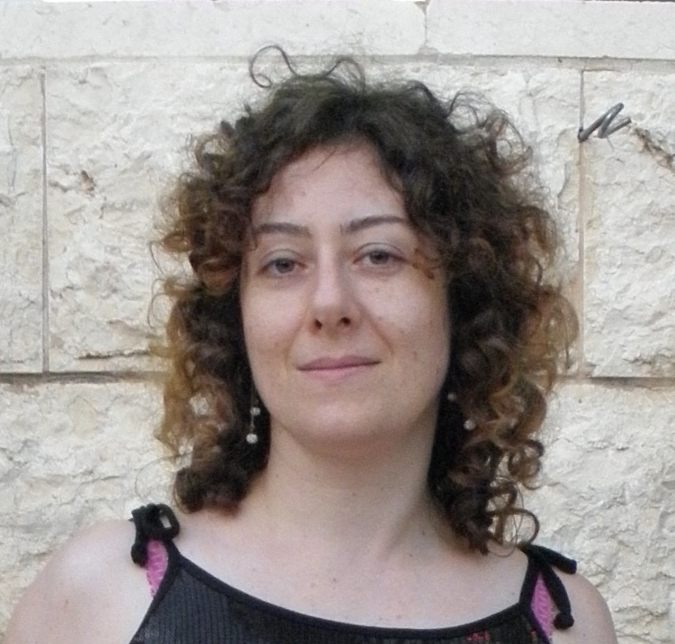

The Team
########
:date: 2016-06-22 20:33
:author: RevAmp Technologies
:slug: the-team
:status: published

**RevAmp Technologies is a small Israeli startup.**
   **Our founders are:**

Solomon Khmelnik, Ph.D., CSO
____________________________
|Solomon Khmelnik, Ph.D.|

Solomon is the man behind the science and the technology. His expertise, thoroughness, and dedication made these scientific and technological domains accessible. Solomon has a Ph.D. in technical sciences, and his areas of expertise include electrical engineering, designing hardware for high-speed arithmetic computations, and (search method for global solutions of) the Navier-Stokes equations.

Inna Doubson, COO
_________________
|Inna Doubson, COO|

Inna, Solomon's daughter, assists him in many ways. Inna has been
collaborating with Solomon for years, both in the field of hardware
design and in his physics related projects.

Michael Dan Mossinsohn, CEO
___________________________
|Michael Dan Mossinsohn, CEO|

Michael is an IT specialist who spent years studying alternative methods
for energy 'generation'. He is dedicated to bringing about a future of
sustainable abundance for humankind.

